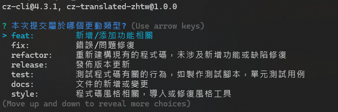
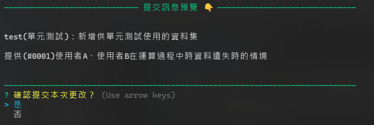
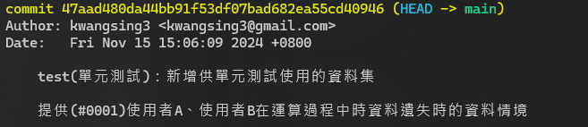

# cz-translated-zhtw

不知道在 commit 的時候寫什麼? 寫太簡潔怕久了之後自己也看不懂?

此庫是一個依循 [Conventional Commit](https://www.conventionalcommits.org/zh-hant/v1.0.0/) 原則進行提交的 git commit message 開發工具，

基於 [Commitizen](https://github.com/commitizen/cz-cli) 運作並製作成繁體中文的擴展元件，可在項目需要時自行添加選項。

# Install Package

### Install globally

```bash
$ npm install -g commitizen cz-translated-zhtw
```

```json
// touch ~/.czrc (在當前使用者資料夾新增.czrc檔  例如: ~/.czrc)
{
  "path": "cz-translated-zhtw"
}
```

### or locally

```bash
$ npm install --save-dev commitizen cz-translated-zhtw
```

```json
//package.json
"script": {
    "commit": "git-cz",
}
...
...
  "config": {
    "commitizen": {
      "path": "cz-translated-zhtw"
    }
  },
...
```

# Usage

### **#commit**

```bash
$ git-cz
# or
$ cz

$ npm run commit #locally
```

1. 選取提交項目的種類

   

2. 依照提示輸入描述

   

3. 預覽

   

4. 結果

   

# TODO and Others

- 技術上而言專案的使用及安裝不局限於 NPM 或 Nodejs 項目(可另外 pkg 執行檔)
- ...
- ...
